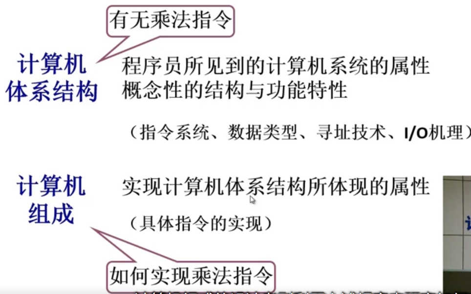
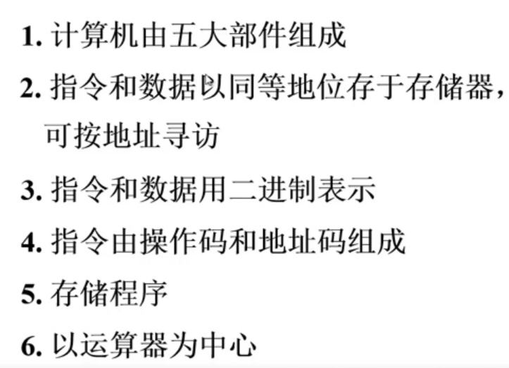

# 计算机组成原理

以哈工大MOOC为注的学习记录。

## 计算机系统概论

### 计算机系统简介

处理系统复杂性的方法--抽象，隐藏系统当中不重要的细节。
把计算机结构进行简化抽象，可得到：

| 硬件 | 软件 |
| --- | --- |
| 计算机的实体，如主机外设等 | 由具有各类特殊功能的信息（程序组成）|

软件可以进一步细化为：

| 系统软件 | 应用软件 |
| --- | --- |
| 用来管理整个计算机系统 | 按任务需要编制成的各种程序 |
| 如语言处理程序，操作系统，服务性程序，数据库系统，网络软件等 | 如文本处理程序，音乐播放器，游戏等 |

简单的划分并不足以体现出硬件与软件之间的逻辑关系，我们可以用一个简单的层次结构描述这种逻辑关系。

下层为硬件，进行了相对的封装，为软件提供了接口（如指令集，软件可以利用指令集编写能够完成一定功能的程序）。软件划分为系统软件与应用软件，系统软件利用硬件提供的接口完成自己的功能（如对系统的软硬件资源进行管理，为用户提供人机交互界面等），应用软件应用系统软件提供的接口，调用系统软件的功能，实现自己的功能。

通过封装可以分层实现一个复杂的计算机系统（处理好各层接口的前提下）

从机器角度看，计算机系统的层次结构：

- 硬件层
- 微架构层
- 系统软件层
- 应用软件层
- 通信和网络

从程序员角度看，计算机系统的层次结构：

- 高级语言层
- 汇编语言层
- 操作系统层
- 机器语言层
- 微指令系统层（用于实现机器指令的具体操作）

计算机系统和计算机组成的区别：

实现指逻辑实现。

### 计算机的基本组成

存储程序结构的计算机（数据与程序都以二进制形式存储在计算机中）称为冯诺依曼计算机。

冯诺依曼计算机由运算器，控制器，存储器，输入设备，输出设备。

特点：

核心特征为存储程序。
