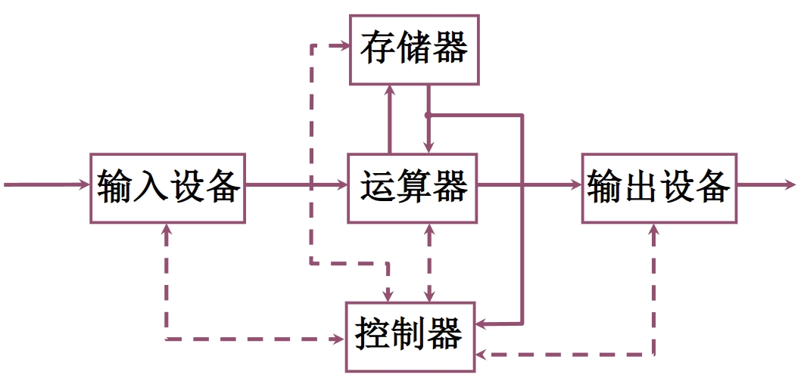
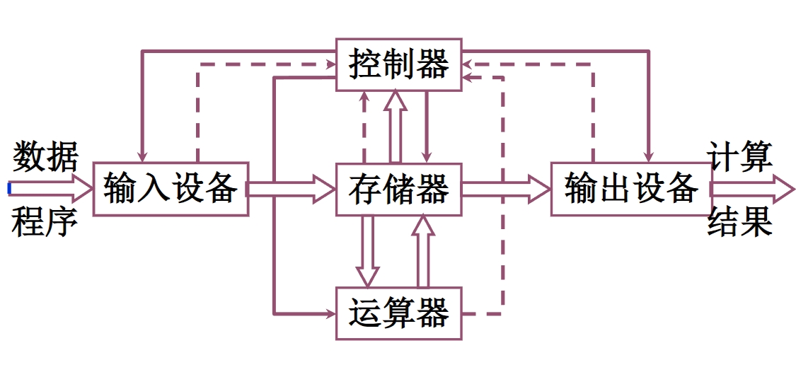
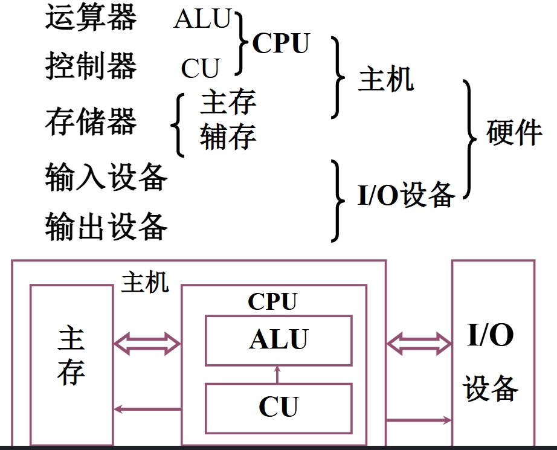
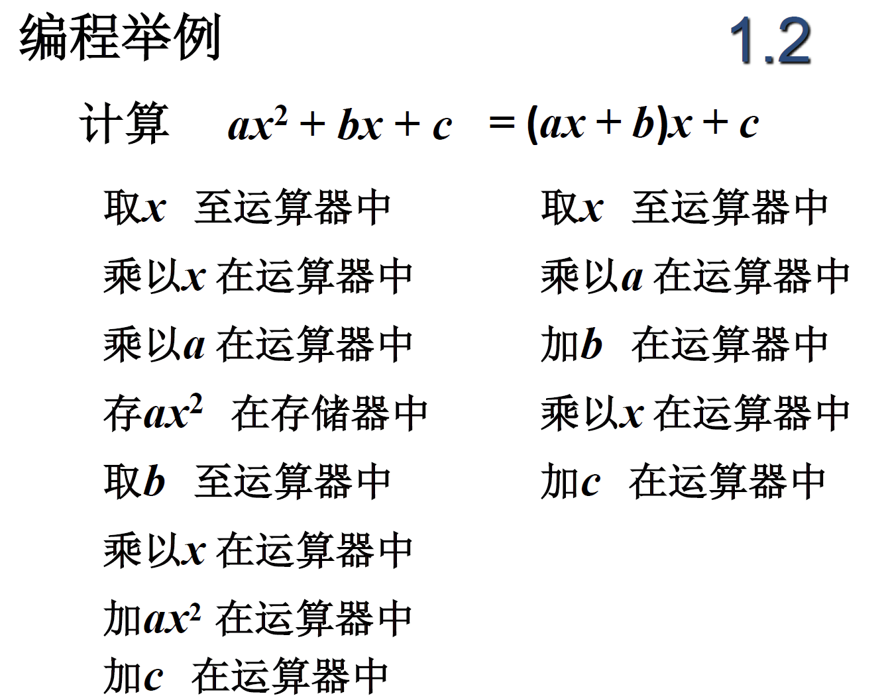

# 计算机组成原理

以哈工大MOOC为主的学习记录。

## 计算机系统概论

### 计算机系统简介

处理系统复杂性的方法--抽象，隐藏系统当中不重要的细节。
把计算机结构进行简化抽象，可得到：

| 硬件 | 软件 |
| --- | --- |
| 计算机的实体，如主机外设等 | 由具有各类特殊功能的信息（程序组成）|

软件可以进一步细化为：

| 系统软件 | 应用软件 |
| --- | --- |
| 用来管理整个计算机系统 | 按任务需要编制成的各种程序 |
| 如语言处理程序，操作系统，服务性程序，数据库系统，网络软件等 | 如文本处理程序，音乐播放器，游戏等 |

简单的划分并不足以体现出硬件与软件之间的逻辑关系，我们可以用一个简单的层次结构描述这种逻辑关系。

下层为硬件，进行了相对的封装，为软件提供了接口（如指令集，软件可以利用指令集编写能够完成一定功能的程序）。软件划分为系统软件与应用软件，系统软件利用硬件提供的接口完成自己的功能（如对系统的软硬件资源进行管理，为用户提供人机交互界面等），应用软件应用系统软件提供的接口，调用系统软件的功能，实现自己的功能。

通过封装可以分层实现一个复杂的计算机系统（处理好各层接口的前提下）

从机器角度看，计算机系统的层次结构：

- 硬件层
- 微架构层
- 系统软件层
- 应用软件层
- 通信和网络

从程序员角度看，计算机系统的层次结构：

- 高级语言层
- 汇编语言层
- 操作系统层
- 机器语言层
- 微指令系统层（用于实现机器指令的具体操作）

计算机系统和计算机组成的区别：

实现指逻辑实现。

### 计算机的基本组成

#### 冯诺依曼计算机简介

存储程序结构的计算机（数据与程序都以二进制形式存储在计算机中）称为冯诺依曼计算机。

冯诺依曼计算机的特点为：

1. 计算机由五大部件组成
2. 指令和数据以同等地位存于存储器
可按地址寻访
3. 指令和数据用二进制表示
4. 指令由操作码和地址码组成
5. 存储程序
6. 以运算器为中心

冯诺依曼计算机由以下五部分组成

- 运算器 // 算术运算，逻辑运算
- 控制器 // 指挥程序运行
- 存储器 // 存放数据和程序
- 输入设备 // 转换成用户熟悉的形式
- 输出设备 // 转换成机器能识别的的形式

对应的硬件框图如下：

上述计算机以运算器为中心，观察框图可发现，各种操作都要经过运算器，使得运算器压力巨大，且运算器成为整个计算机的瓶颈；整个结构比较混乱，不具有层次化的特征。

我们是否可以进一步把这个硬件框图以自顶向下的形式进行结构化的分析？

#### 冯诺依曼计算机的改进

首先，我们不再以运算器为核心，转而变为以存储器为中心，实现输入输出设备与存储器之间直接的信息交换。
运算器运算所需的数据与运算完成的结果都可以与存储器交换。控制器感知系统的运行。

这样得到的硬件框图如下：

但这样仍没有形成层次化的结构。我们直接来看现代计算机的结构：

其次我们来看管理系统复杂性的方法(3Y)：

- 层次化(Hierachy)：将被设计的系统划分为多个模块或子模块
- 模块化(Modularity)：有明确定义(well-defined)的功能和接口
- 规则性(regularity)：模块更容易被重用

#### 利用 个问题来细化之前的框图

问题1：一个现实中的问题，如何用计算机来解决？

问题2：是不是所有的问题都可以用计算的方法来解决？

假设我们面对的是一个可以有计算机解决的问题，如何用计算机来解决这个问题呢？

解决问题并不是直接就开始编写程序，我们需要进行一些上机前的准备：

1. 建立数学模型
2. 确定计算方法
3. 编制解题程序

所以，我们可以说，程序是运算的全部步骤，指令则是每一个步骤。

举个例子：

