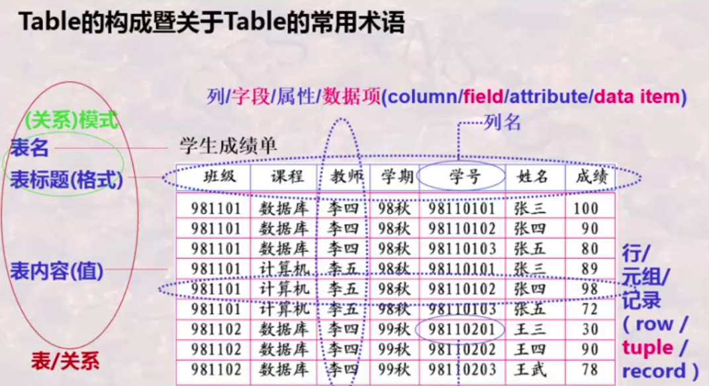
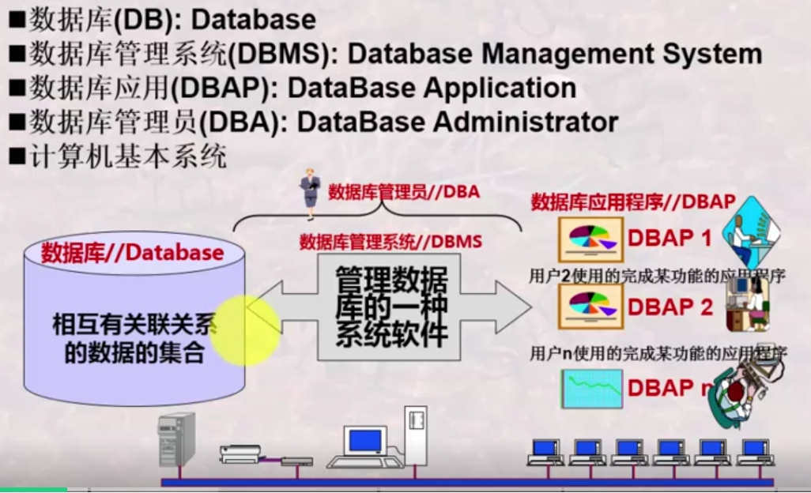
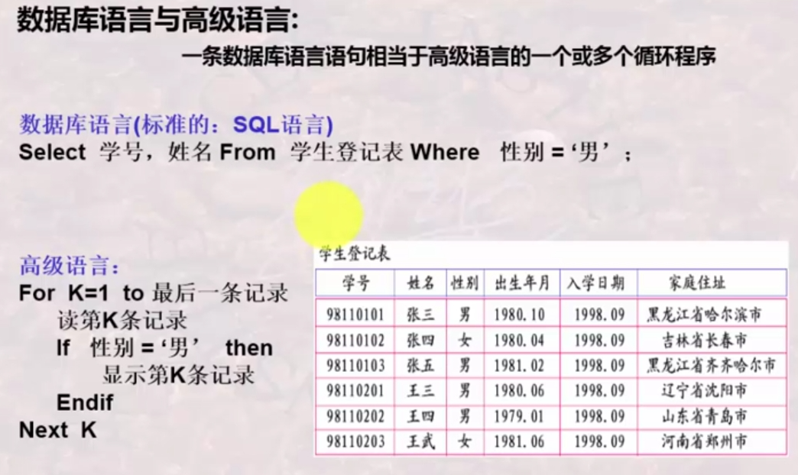
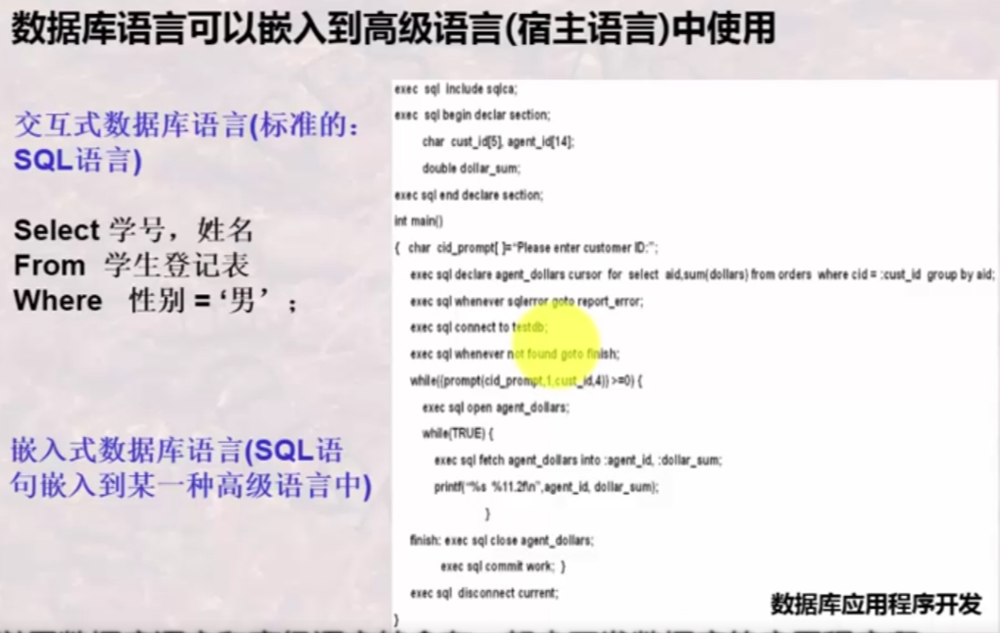
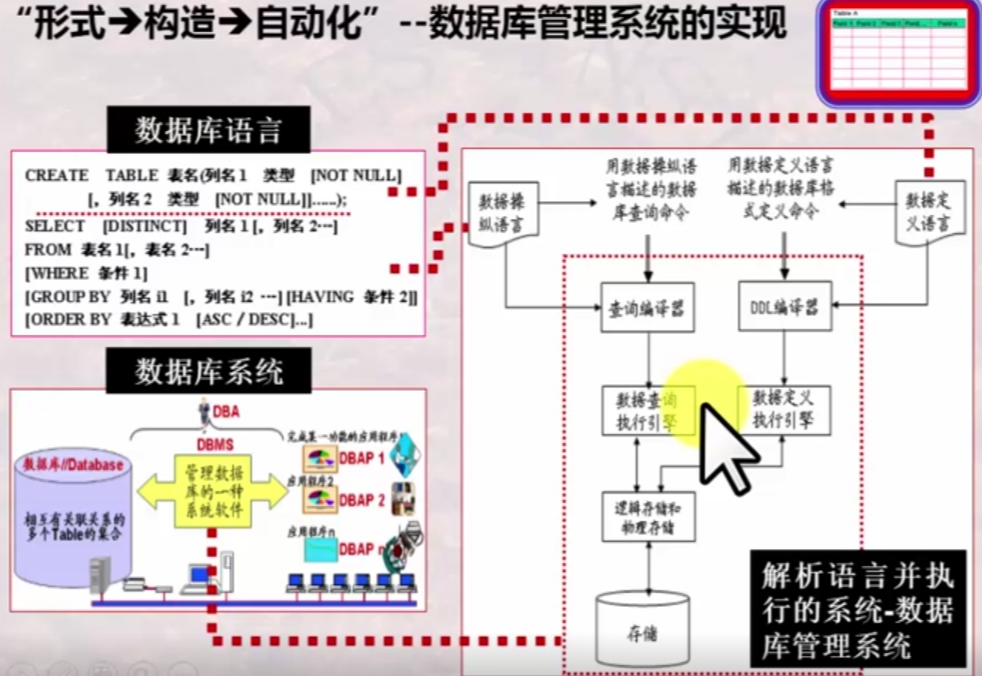
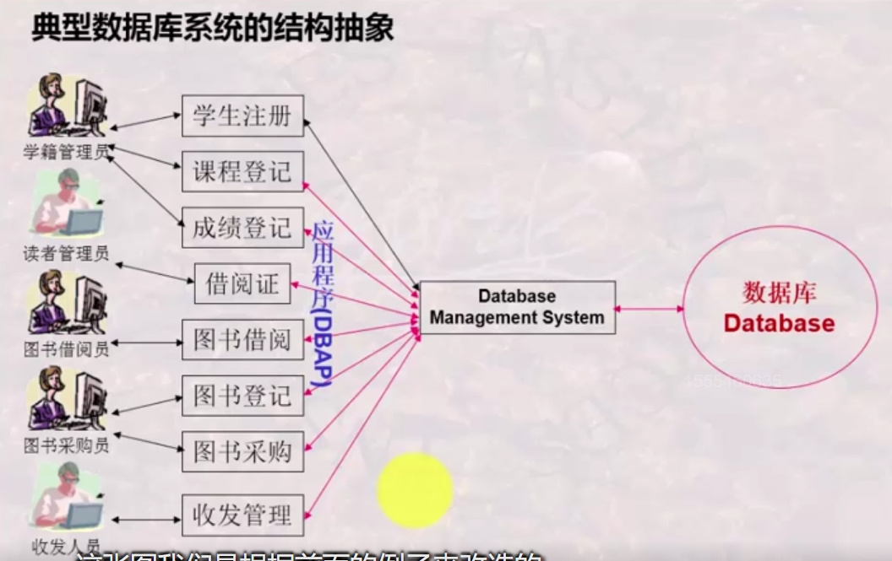
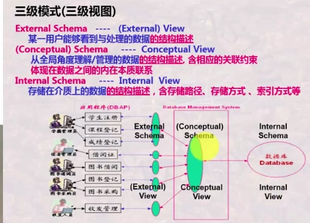
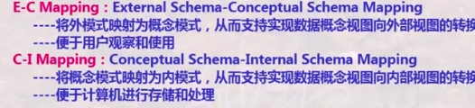
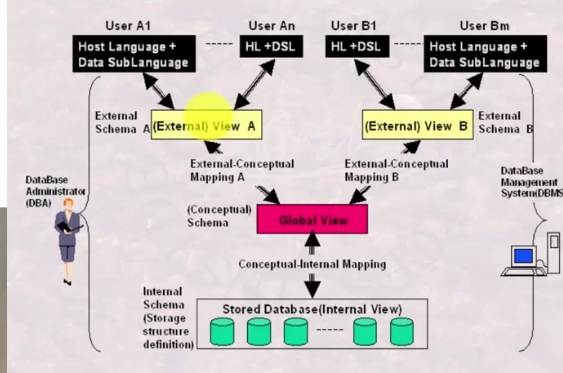
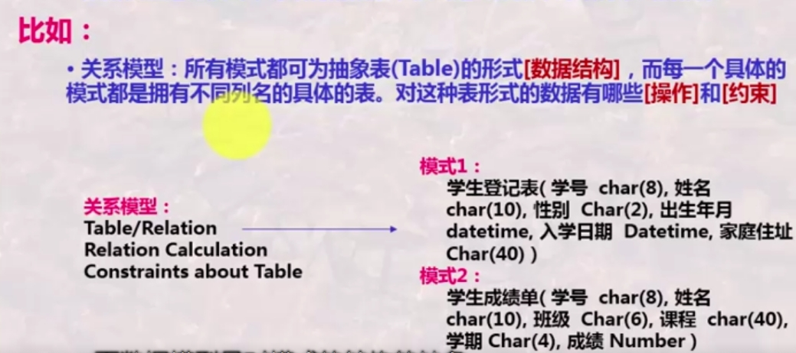

# 数据库系统

这里主要是综合了MOOC的课程和《数据库系统概念》这本书进行的理解记录。

## 初步认识数据库

**初步认知**：数据库是数据的集合，数据库管理系统是管理数据库的一个管理软件，数据库系统是由数据库、数据库管理系统、应用程序和数据库管理员组成的系统。

### 什么是数据库

#### 数据库的概念

**数据库是电子化信息的集合**
将信息“规范化”并使之“电子化”，形成电子信息“库”，以便利用计算机对这些信息进行快速有效的存储、检索、统计与管理。

#### 表的构成及术语

**数据库起源于对“表（Table）”的处理。**

那么，我们如何理解“表”及它所含的内容呢？

1.构成

Table中描述了一批具有关联关系的数据，可将Table**称为**关系（意思是近似于不是等同）

由上，我们可得到数据库的**定义**：相互之间有关联关系的若干个表（Table）的集合。

数据库的种类有很多，如：关系数据库，图像数据库，工程数据库等等……
一般将关系数据库称为结构化数据库，其他的称为非结构化数据库。
**关系数据库是所有数据库的基础**

### 什么是数据库系统

数据库系统的构成：

### 从用户角度看数据库管理系统

数据库管理系统（DBMS）是用于定义、创建、管理和控制数据库的软件产品。

1.数据库**定义**。（格式定义）
    - 提供一套数据定义*语言*（DDL）。
    - 用户使用DDL描述要建立表的格式。
    - DBMS依照用户定义，创建DB及其中的Table。
  
2.数据库**操纵**（对DB中Table的数据增删改，查询检索统计等）
    - 提供一套数据操纵*语言*（DML）
    - 用户使用DML增删改等。
    - DBMS执行这些操作
  
3.数据库**控制**（控制DB中数据的使用——哪些用户可以使用，哪些用户不可以）
    - 同上（数据库控制*语言*叫DCL）

4.数据库**维护**（转储，恢复，重组，性能检测，分析……）
    - DBMS提供一系列*程序*给用户
    - 同上
    - **一般由DBMA使用**

**注意**这里的用户是指DBA及使用DBAP的用户

以上提到的三种语言（DDL，DML，DCL）综合起来即为SQL语言：结构化的数据库语言。

那么，数据库语言与高级语言有什么区别与联系呢？

- 区别

(此处的高级语言忽略了打开文件等操作)

- 联系

### 从系统角度看数据库管理系统

即数据库执行的一系列例行程序。

​数据库语言及其编译、查询实现与查询优化、事务处理功能以及数据存储与索引等其他功能。

## 数据库系统的结构与演变

重难点：

- 一组概念的区分：三级模式两层映像，物理逻辑性和逻辑独立性。
- 一组概念的区分：数据->模式->数据模型
- 几组数据模型的差异：网状/层次模型->关系模型->XX数据模型

### 数据库系统的标准结构

#### 数据库系统的分层抽象

数据库系统的 ***结构抽象*** 一般由用户层，应用程序层，DBMS层，数据库层组成。

而DBMS层管理数据，又将数据分为了三个层次。即为后文所说的三级模式。

- 外模式（用户模式/子模式）
  某一用户能够 ***看到与处理*** 的数据，全局数据的某一部分。
- 模式（概念模式）
  从全局角度 ***理解/管理*** 的数据，含相应的关联约束
- 内模式（存储模式）
  存储在介质上的数据，含存储路径、存储方式、索引方式等。

#### 数据（视图）与模式

数据又可以用模式和视图来描述。

- 模式（schema）
  对数据库中数据所进行的一种结构性的描述所观察到数据的 ***结构信息***。（即：数据的结构）
- 视图（view）/数据（data）
  某一种 ***表现形式*** 下表现出来的数据库中的数据。

#### 三级模式与两层映像

- **三级模式**
  
  如果只说视图，一般指的是外部视图，即给用户看的视图。外部视图可以有多个。
  只说模式，一般指概念模式。
- **两层映像**
  将一种模式（结构）映射为另一种模式（结构），这里映射的 ***过程*** 称为映像。
  

三级模式两层映像即为数据库的标准结构。

为保证数据库可以独立改变模式而不影响其他，数据库系统有两个独立性：

- 逻辑数据独立性
  当概念模式变化时，可以不改变外部模式，只需改变EC映射，从而无需改变应用程序。
- 物理数据独立性
  当内部模式变化时，可以不改变概念模式，只需改变CI映射，从而无需改变概念模式和外部模式。

### 什么是数据模型？

#### 数据模型的概念

规定模式统一描述方式的模型，包括：数据结构，操作和约束。
数据模型是对模式本身结构的抽象，模式是对数据本身结构形式的抽象。（即：模型是数据结构的结构）

三大经典数据模型对应的数据结构：

- 关系模型：表形式【重要】
- 层次模型：树形式
- 网状模型：图形式

### 数据库系统的演变与发展
